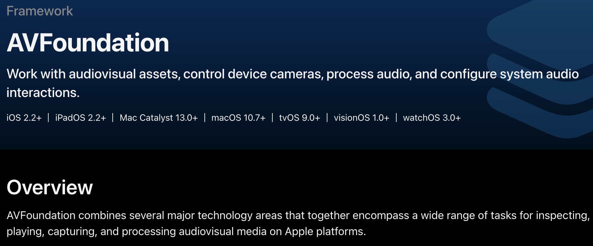

# AVFoundation 알아보기

# 기능

- 미디어 재생 - 오디오 및 비디오 파일을 재생
- 미디어 녹화 - 카메라 및 마이크를 사용하여 오디오 및 비디오를 녹화
- 미디어 편집 - AVAsset 및 AVAssetTrack 클래스를 사용하여 미디어 파일을 자르거나 병합, 수정이 가능
- 미디어 스트리밍 - 네트워크를 통해 미디어를 스트리밍 가능
- 메타데이터 관리 - 미디어 파일의 메타데이터를 읽거나 쓰기 가능


## **AVAsset**

- url로 미디어를 객체화하는 역할
- track - AVAsset에 있는 미디어 데이터의 각 부분
- 일반적으로  AVAsset은 데이터가 큼 → 비동기 처리 필요

## AVKit

- AVKit은 AVFoundation위에 존재
- 미디어 플레이어 Interface를 쉽게 제공하는 SDK
- 화면에 자막을 표출하는 기능 제공



대충 미디어 Asset들로 카메라 제어나 오디오 처리등을 한다는 얘기...<br>
동영상 재생을 주 목적으로 사용하게 될 듯해서 동영상 처리에 필요한 AVPlayerLayer를 알아봐야 할듯하다.<br>
조금 더 알아보자면 플레이어 인스턴스는 재사용이 가능한데, replaceCurrentItem을 사용하여 재생중인 미디어 에셋을 교체해주면된다고 한다.<br>
또한 미디어 에셋의 실행 순서에 관해서는 AVQueuePlayer를 통해 큐를 관리하면 된다.<br>
AVPlayer는 미디어 에셋을 재생하는 역할이지만 이것만 가지고는 영상 재생일 힘들고 동적인 역할을 하는 AVPlayerItem를 생성해야 한다.<br>
정리하자면 Asset 형태로 저장되는 데이터를 재생을 위해 AVPlayerItem 형태로 바꿔주고 AVPlayer가 그 AVPlayerItem을 재생시키는 듯 하다.<br>

## AVAsset?
AVAsset이란 개념이 아직 익숙하지가않은데 AVFoundation의 주요 기능 중 하나이므로 좀 알아보고 넘어가야할듯하다. <br>
Asset은 추상적이고, 하나의 미디어 리소스를 나타내는 불변 타입이며 AVFoundation에서는 AVAsset이라는 클래스를 이용해 asset을 모델링함다는데 잘 이해가 안된다 ㅎ <br> 
AVAsset은 두 가지 방법으로 미디어 작업을 간단하게 할 수 있도록 해준다고 한다. <br>
1. 미디어의 타입, format에 상관없이 일관된 인터페이스를 제공한다. container format, codec 타입에 관한 작업은 프레임워크가 대신 하고, 앱에서는 어떻게 asset을 이용할건지에 대한 것만 신경쓰면 된다.
2. 미디어의 위치에 상관없이 Asset 인스턴스를 쉽게 생성할 수 있다. Asset을 생성할 때는 미디어의 URL을 이용하고 이때 이 URL 위치가 app bundle인지, local URL인지, 서버에 있는 HLS stream인지는 상관이 없다. 어떤 위치의 미디어든지, AVFoundation은 효율적으로 가장 적절한 시점에 미디어를 업로드 한다.

## 순서
1. AVPlayer 생성
<br>

``` swift
private var player = AVPlayer()
```

2. 비디오의 정보를 담고있는 AVAsset 생성
<br>

```swift
let asset = AVAsset(url: url)
```

3. Asset을 이용하여 AVPlayerItem 생성
<br>

``` swift
let item = AVPlayerItem(asset: asset)
self.player.replaceCurrentItem(with: item)
```
4. AVPlayerLayer 생성
<br>

``` swift
let playerLayer = AVPlayerLayer(player: self.player)
playerLayer.frame = self.videoBackgroundView.bounds
playerLayer.videoGravity = .resizeAspectFill
```

5. AVPlayerLayer를 원하는 뷰에 삽입
<br>

``` swift
self.videoView.layer.addSublayer(playerLayer)
```

<br>
<br>
아직 실제로 코드를 실행해보지 않아서 결과물은 알 수 없지만 어느정도 흐름 파악에는 도움이 된 것 같다.
프로젝트에 적용은 다음번에 알아보자..
